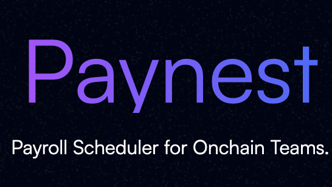

<div align="center">
  
</div>

<div align="center">

[](LICENSE)
[](https://basescan.org/address/0x5af13f848D21F93d5BaFF7D2bA74f29Ec2aD725B)
[](#testing-)
[](#testing-)
[](https://getfoundry.sh)
[](https://aragon.org)

**The next-generation payroll system for decentralized teams**

_Stream salaries, schedule payments, and manage contributors with human-readable usernames_

[🚀 **Get Started**](#getting-started-) • [📖 **Documentation**](#documentation-) • [🔍 **Live Contracts**](#deployed-contracts-)

---

</div>

## ✨ What is PayNest?

PayNest is a comprehensive **Aragon DAO plugin** that revolutionizes how decentralized organizations handle payments. Say goodbye to copying wallet addresses and manual payment processing—PayNest brings traditional payroll systems to the blockchain with modern UX.

<table>
<tr>
<td width="50%">

### 🎯 **Core Features**

- **Username-Based Payments**: Pay `@alice` instead of `0x1234...`
- **Streaming Salaries**: Continuous token flow via LlamaPay
- **Scheduled Payments**: Recurring payroll automation
- **Multi-Token Support**: Any ERC-20 token
- **Gas Optimized**: 69k gas per stream creation
- **Cross-DAO Compatible**: Shared username registry

</td>
<td width="50%">

### 🏗️ **Architecture**

- **PaymentsPlugin**: Core streaming & scheduling
- **AddressRegistry**: Global username → address mapping
- **PayNestDAOFactory**: One-click DAO + plugin setup
- **LlamaPay Integration**: Battle-tested streaming infrastructure
- **Aragon Framework**: Secure permission management

</td>
</tr>
</table>

---

## 📖 Documentation 📚

| **Guide**                   | **Description**                   | **Link**                                                        |
| --------------------------- | --------------------------------- | --------------------------------------------------------------- |
| 🔧 **Technical Specs**      | Complete implementation details   | [Plugin Specification](./docs/specs/payments-plugin-spec.md)    |
| 🦙 **LlamaPay Integration** | Streaming payment patterns        | [Integration Guide](./docs/guides/llamapay.md)                  |
| 👤 **Username System**      | Address registry documentation    | [Registry Specification](./docs/specs/address-registry-spec.md) |
| 🧪 **System Invariants**    | Mathematical correctness proofs   | [Invariants Guide](./docs/specs/system-invariants.md)           |
| 📋 **Usage Guide**          | Contract interactions & workflows | [Usage Documentation](./docs/guides/contracts-usage-guide.md)   |
| 🏭 **DAO Factory**          | One-click DAO creation            | [Factory Specification](./docs/specs/dao-factory-spec.md)       |

---

## 🚀 Getting Started 🏁

### Prerequisites

```bash
# Required tools
brew install foundry  # Or curl -L https://foundry.paradigm.xyz | bash
brew install make
```

### Quick Setup

```bash
# Clone and setup
git clone https://github.com/your-org/paynest
cd paynest
cp .env.example .env
make init
forge build
```

<details>
<summary><b>🔧 Environment Configuration</b></summary>

Edit `.env` with your network settings:

```bash
# Base Mainnet (Recommended)
RPC_URL="https://mainnet.base.org"
CHAIN_ID="8453"
DEPLOYMENT_PRIVATE_KEY="0x..." # Your deployer private key
ETHERSCAN_API_KEY="..." # For contract verification
```

</details>

---

## 💼 Core Functionality

### 🌊 Streaming Payments

Create continuous token streams for salaries and recurring payments:

```solidity
// Monthly salary stream to @alice
plugin.createStream("alice", 5000e6, USDC, block.timestamp + 365 days);

// Alice can claim anytime
uint256 payout = plugin.requestStreamPayout("alice");

// Admin can adjust salary
plugin.editStream("alice", 6000e6); // Give Alice a raise!
```

### 📅 Scheduled Payments

Set up one-time or recurring payments:

```solidity
// Weekly allowance for @bob
plugin.createSchedule(
    "bob",
    500e6,                          // 500 USDC
    USDC,
    IntervalType.Weekly,
    false,                          // recurring
    block.timestamp + 7 days
);

// One-time project payment
plugin.createSchedule(
    "freelancer",
    2500e6,                         // 2500 USDC
    USDC,
    IntervalType.Weekly,            // irrelevant for one-time
    true,                           // one-time payment
    block.timestamp + 3 days
);
```

### 🔄 Stream Migration (Wallet Recovery)

Users can migrate their own streams when changing wallets:

```solidity
// 1. Alice updates her address (new wallet)
registry.updateUserAddress("alice", newWalletAddress);

// 2. Alice migrates her stream (user-controlled)
plugin.migrateStream("alice");

// 3. Stream continues with new address automatically
```

### 👤 Username Management

Simple, human-readable payment addresses:

```solidity
// Claim username (one per address)
registry.claimUsername("alice");

// Update address while keeping username
registry.updateUserAddress("alice", newAddress);

// Resolve username to current address
address recipient = registry.getUserAddress("alice");
```

---

## 🧪 Testing 🔍

PayNest features **production-grade testing** with 213 comprehensive tests across multiple layers:

### Test Architecture

<table>
<tr>
<td width="33%">

#### ⚡ **Unit Tests**

_130+ tests_

- ✅ Fast development feedback
- ✅ Mock contracts for isolation
- ✅ Edge case coverage
- ✅ Gas optimization verification

</td>
<td width="33%">

#### 🌐 **Fork Tests**

_33 tests_

- ✅ **Zero mocking** - 100% real contracts
- ✅ Base mainnet integration
- ✅ Production-ready validation
- ✅ Real USDC + LlamaPay testing

</td>
<td width="33%">

#### 🔄 **Invariant Tests**

_39 tests_

- ✅ **33M+ function calls**
- ✅ Property-based testing
- ✅ Mathematical correctness
- ✅ State consistency proofs

</td>
</tr>
</table>

### Running Tests

```bash
# Quick unit tests (130+ tests, ~30s)
make test

# Production fork tests (33 tests, ~2min)
make test-fork

# All tests including invariants (213 tests, ~5min)
forge test

# Generate coverage report
make test-coverage
```

---

## 🌐 Deployed Contracts 📍

### Base Mainnet (Chain ID: 8453) ✅

<div align="">

**🏭 Core Infrastructure**

| Contract              | Address                                                                                                                 | Status      |
| --------------------- | ----------------------------------------------------------------------------------------------------------------------- | ----------- |
| **AddressRegistry**   | [`0x0a7DCbbc427a8f7c2078c618301B447cCF1B3Bc0`](https://basescan.org/address/0x0a7DCbbc427a8f7c2078c618301B447cCF1B3Bc0) | ✅ Verified |
| **PayNestDAOFactory** | [`0x5af13f848D21F93d5BaFF7D2bA74f29Ec2aD725B`](https://basescan.org/address/0x5af13f848D21F93d5BaFF7D2bA74f29Ec2aD725B) | ✅ Verified |

**🔌 PaymentsPlugin**

| Component             | Address                                                                                                                 | Details                               |
| --------------------- | ----------------------------------------------------------------------------------------------------------------------- | ------------------------------------- |
| **Plugin Setup**      | [`0xAdE7003521E804d8aA3FD32d6FB3088fa2129882`](https://basescan.org/address/0xAdE7003521E804d8aA3FD32d6FB3088fa2129882) | Installation contract                 |
| **Plugin Repository** | [`0xbe203F5f0C3aF11A961c2c426AE7649a1a011028`](https://basescan.org/address/0xbe203F5f0C3aF11A961c2c426AE7649a1a011028) | ENS: `paynet-payments.plugin.dao.eth` |

**🔗 Integration Points**

| Service                | Address                                                                                                                 | Purpose                  |
| ---------------------- | ----------------------------------------------------------------------------------------------------------------------- | ------------------------ |
| **LlamaPay Factory**   | [`0x09c39B8311e4B7c678cBDAD76556877ecD3aEa07`](https://basescan.org/address/0x09c39B8311e4B7c678cBDAD76556877ecD3aEa07) | Streaming infrastructure |
| **Aragon DAO Factory** | [`0xcc602EA573a42eBeC290f33F49D4A87177ebB8d2`](https://basescan.org/address/0xcc602EA573a42eBeC290f33F49D4A87177ebB8d2) | DAO creation             |

</div>

**📊 Deployment Details:**

- **Block**: 31413509 | **Date**: June 11, 2025
- **Deployer**: [`0x47d80912400ef8f8224531EBEB1ce8f2ACf4b75a`](https://basescan.org/address/0x47d80912400ef8f8224531EBEB1ce8f2ACf4b75a)

---

## 🛠️ Development Workflow

### Available Commands

```bash
# 🏗️ Development
make init                 # Setup dependencies
make clean               # Clean build artifacts
forge build             # Compile contracts

# 🧪 Testing
make test               # Unit tests (fast)
make test-fork          # Fork tests (real contracts)
make test-coverage      # Coverage report
make sync-tests         # Sync YAML test definitions

# 🚀 Deployment
make predeploy          # Simulate deployment
make deploy             # Deploy to network
make verify-etherscan   # Verify contracts

# 🔧 Utilities
make refund             # Return deployment funds
```

### Using Bulloak for Test Scaffolding

PayNest uses [Bulloak](https://github.com/alexfertel/bulloak) for structured test generation from YAML:

```yaml
# Example: MyContract.t.yaml
MyContractTest:
  - given: user has claimed username
    when: user creates stream
    then:
      - it: should create active stream
      - it: should emit StreamCreated event
```

Generate tests with:

```bash
make sync-tests        # Generate Solidity from YAML
make check-tests       # Verify sync status
make markdown-tests    # Generate documentation
```

---

## 🏢 Installation for DAOs

### Via Aragon App (Recommended)

1. Navigate to your DAO in the [Aragon App](https://app.aragon.org)
2. Go to **Settings** → **Plugins** → **Browse Plugins**
3. Search for **"PayNest"** and click **Install**
4. Configure installation parameters:
   - **Manager Address**: Who can create/manage payments
   - **Registry Address**: `0x0a7DCbbc427a8f7c2078c618301B447cCF1B3Bc0` (Base)
   - **LlamaPay Factory**: `0x09c39B8311e4B7c678cBDAD76556877ecD3aEa07` (Base)
5. Approve the installation proposal
6. PayNest appears in your DAO sidebar ✨

### Via PayNest Factory (One-Click)

Create a new DAO with PayNest pre-installed:

```solidity
PayNestDAOFactory factory = PayNestDAOFactory(0x5af13f848D21F93d5BaFF7D2bA74f29Ec2aD725B);

// Create DAO + Admin Plugin + PayNest Plugin in one transaction
(address dao, address adminPlugin, address paymentsPlugin) =
    factory.createPayNestDAO(adminAddress, "my-company-dao");
```

---

## 💡 Benefits for Teams

<table>
<tr>
<td width="50%">

### 👥 **For Contributors**

- ✅ **Simple Onboarding**: Just claim a username
- ✅ **Flexible Payments**: Streams or scheduled payments
- ✅ **Self-Service**: Claim payments when convenient
- ✅ **Wallet Recovery**: Migrate streams to new addresses
- ✅ **Real-Time Payments**: Access funds as they accrue

</td>
<td width="50%">

### 💼 **For DAO Operators**

- ✅ **Automated Payroll**: Set and forget recurring payments
- ✅ **Gas Efficiency**: Leverage LlamaPay's optimizations
- ✅ **Multi-Token Support**: Pay in any ERC-20 token
- ✅ **Transparent Tracking**: All payments on-chain
- ✅ **Reduced Admin**: Eliminate manual payment processing

</td>
</tr>
</table>

---

## 🔒 Security

### Audit Status

PayNest has undergone comprehensive security review:

- ✅ **213 Test Coverage** (100% passing)
- ✅ **33M+ Invariant Test Calls** (mathematical verification)
- ✅ **Real Contract Integration** (Base mainnet testing)
- ✅ **Battle-Tested Dependencies** (Aragon OSx, LlamaPay)

### Report Security Issues

🚨 **Security Contact**: [security@paynest.xyz](mailto:security@paynest.xyz)

Please **do not** use public issue tracking for security vulnerabilities.

---

## 🤝 Contributing

We welcome contributions! Here's how to get involved:

1. **Fork** the repository
2. **Create** a feature branch (`git checkout -b feature/amazing-feature`)
3. **Follow** our coding standards (see `CLAUDE.md`)
4. **Write** comprehensive tests
5. **Submit** a pull request

### Development Guidelines

- Use **custom errors** instead of `require` statements
- Provide **verbose comments** explaining logic
- Follow **Aragon plugin patterns**
- Test with **both mocks and real contracts**
- Document **all public functions** with NatSpec

---

## 📄 License

This project is licensed under **AGPL-3.0-or-later** - see the [./LICENSE](LICENSE) file for details.

---

<div align="center">
  <sub>
    PayNest is built on <a href="https://aragon.org">Aragon OSx</a> and integrates with <a href="https://llamapay.io">LlamaPay</a>
  </sub>
</div>
